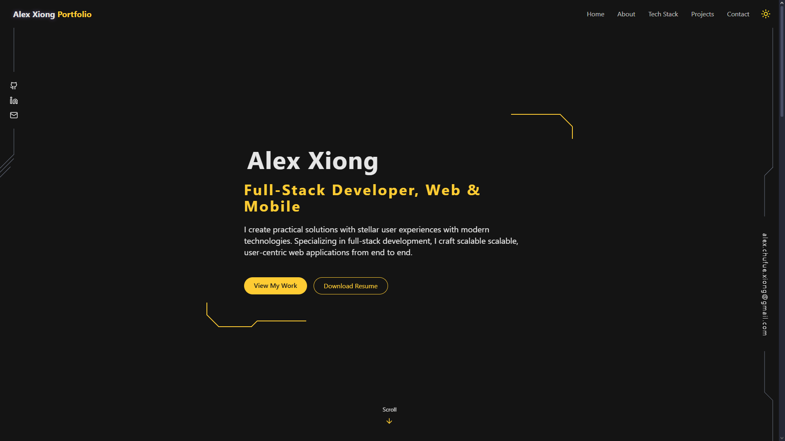

# Alex Xiong – Portfolio Website

Welcome to my personal portfolio website, built with **React**, **Vite**, and **Tailwind CSS**.  
It showcases my projects, skills, and contact info in a modern, responsive design.

---

**View here:** [xiong-alex.com](https://www.xiong-alex.com)
 

---

## 📖 About the Project

- Built with: React, Vite, Tailwind CSS
- Features:
  - Animated landing section
  - Skills & tech stack
  - Interactive project gallery
  - Custom 404 page
  - Dark mode toggle
- Deployed on: [Vercel](https://vercel.com/)

---

## 🛠 Installation & Setup

```bash
git clone https://github.com/Xiong-Alex/portfolio.git
cd portfolio
npm install
npm run dev
